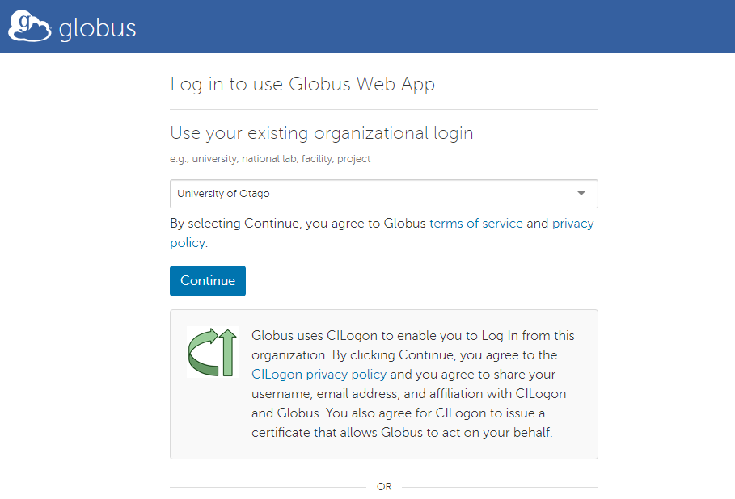
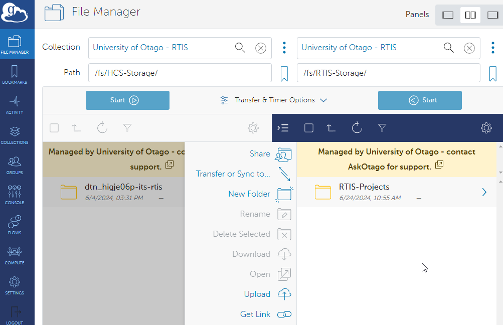

## Transferring data between Research Storage (Ohau) and HCS with Globus

**[Globus](https://www.globus.org/)** is a high-speed, secure data transfer platform that is available to all University of Otago researchers. 
It is a great way to transfer large amounts of data between Otago HCS and the Research Storage, as well as to external institutes.

!!! note
    If you do not yet have a Globus-connected HCS share, please fill out the _[HCS High Speed Data Transfer Service Access Form](<https://www.otago.ac.nz/its/forms/hcs-high-speed-data-transfer-service-access-form)_ and wait for ITS to contact you. You will also need to contact RTIS Solutions to have your Research Storage set up with Globus. For assistance, please email `rtis.solutions@otago.ac.nz <mailto:rtis.solutions@otago.ac.nz>`_ with your university username, HCS share names you would like to connect, and whether you are already a Globus user.

### How To Log in to Globus and transfer data

If you have used Globus before, this process will look a little bit different than you are used to, so please read ahead.

You will need to ensure you are logging in to Globus via your University of Otago login.

Go to `app.globus.org <https://app.globus.org/>`_ and search for "University of Otago" in the "Use your existing organizational login" section of the page.

This will redirect you to a University of Otago login page. Please sign in with your Otago username and password.

<figure markdown="span">
  { width="600" }
  <figcaption>Choose "University of Otago" from the organisation drop down.</figcaption>
</figure>

!!! note
    You may be prompted to link any existing Globus identities. Do this if you would like to link a GlobusID account with your Otago account.

### Once you are logged in

1. Select the File Manager tab on the left side of the page, and search for "University of Otago - RTIS" in the Collection search box.
1. Use the RTIS endpoint to connect to Research Storage AND HCS. 
1. Navigate to /fs in the path to find the RTIS-Storage and HCS collections (see image below). **University of Otago - HCS endpoint is for off campus transfers and NOT for transfers between Ohau and HCS** 
1. Click on the collection to connect to it, one on each side of the File Manager.
1. You can now transfer files between the two collections by selecting the Directories or files you want to transfer and clicking the Start arrow in the middle of the page pointing in the direction you want to transfer.

<figure markdown="span">
  { width="600" }
  <figcaption></figcaption>
</figure>

You should then see the RTIS-Storage collection as well as the HCS-Storage collection (with dtn_<username>). Click on the collection to connect to it, one on each side of the File Manager.

<figure markdown="span">
  { width="600" }
  <figcaption></figcaption>
</figure>

Table: Mapping of key locations between Aoraki and Globus (University of Otago - RTIS endpoint)

| Directory| Aoraki Path | Globus Path |
|---|---|---|
| Home |/home/<account_name\> (~/) | /home-dtn/<account_name\> (~/) |
| Projects | /projects/ | /fs/RTIS-Storage/RTIS-Projects |
| HCS |/mnt/auto-hcs/<hcs sharename\> | /fs/HCS-Storage/<dtn-sharename\> |

!!! info
    the dtn-sharename may or may not match exactly to the hcs sharename but should be able to be interpretable.

You can now transfer files between the two collections by selecting the Directories or files you want to transfer and clicking the Start arrow in the middle of the page pointing in the direction you want to transfer.

<figure markdown="span">
  { width="600" }
  <figcaption></figcaption>
</figure>

!!! warning

    Ensure that both end points are using "University of Otago - RTIS"

If you have any issues with Globus, please :doc:`contact us </support>`.

### Transferring Data between Research Storage and your Desktop

The RTIS Globus endpoint works with `Globus Connect Personal <https://www.globus.org/globus-connect-personal>`_ and will transfer data to and from your desktop or lab computer.

*Note - the **HCS endpoint** does not work with Globus Connect Personal on campus, but does allow you to share and receive data from other Globus users off campus*

To transfer data between your desktop and Research Storage, you will need to install the Globus Connect Personal application on your desktop. Follow the instructions on the `Globus Connect Personal <https://www.globus.org/globus-connect-personal>`_ page to install it.

Once you have installed Globus Connect Personal, you can connect your desktop endpoint to the RTIS Globus endpoint and transfer data between your desktop and Research Storage.